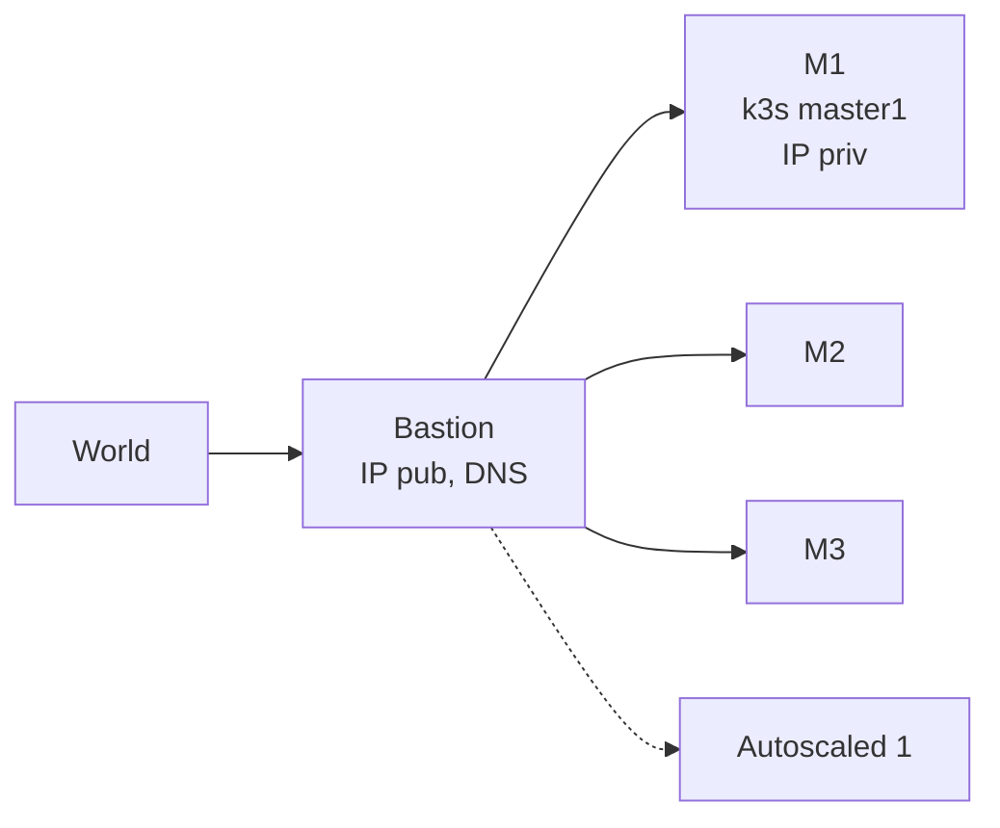

# Hetzner K3s Functions
> A collection of functions to setup K3s clusters on [Hetzner Cloud][hcloud], based on vitobotta's [hetzner-k3s][hk3s]


[](https://github.com/axgkl/hk3sf/actions/workflows/tests.yml)

## About

[Hetzner-k3s][hk3s] is nicely engineered general k3s installation tool on Hetzner, with a large degree of declarative possibilities for customization.

This repo here provides a set of bash functions, for 

https://youtu.be/EvzB_Q1gSds?t=54


## Usage

## Customization

See [here](./docs/customization.md)


```
tests/test_setup.sh log 'cert' -f
1 sync.go:290] "failed to create Order resource due to bad request, marking Order as failed" err="429 urn:ietf:params:acme:error:rateLimited: Error creating new order :: too many certificates (5) already issued for this exact set of domains in the last 168 hours: hello-world.citest.mydomain.net, retry after 2024-08-14T01:31:39Z: see https://letsencrypt.org/docs/duplicate-certificate-limit/" logger="cert-manager.controller" resource_name="hello-world.citest.mydomain.net-tls-1-3489545008" resource_namespace="default" resource_kind="Order" resource_version="v1"
```

## K3s with: HA + AutoScaling + GitOps. 
> For < 20€/month. From Scratch.


## Refs

- [knowledge](./docs/knowledge.md)

- https://community.hetzner.com/tutorials/how-to-set-up-nat-for-cloud-networks
- https://github.com/vitobotta/hetzner-k3s
- https://github.com/vitobotta/hetzner-k3s/issues/379
- https://www.youtube.com/watch?v=u5l-F8nPumE&t=466s
- https://gimlet.io




### Topo: 3 Masters for k8s HA. No API LBs

Why: 

1. don't want to ever have to recover a broken k8s. So: 3.
2. => Workloads on (cheap) masters - but with **autoscaled** add/delete workers if required.

IPs: Priv IPs are for free -> Only 1 pub IP (on a bastion outside the k8s cluster, which runs trivially restorable services w/o k8s). Also more secure, only this to shield.

[Lets build the k3s cluster](./k3s.md)

## Play Time

If new to this world, check these:

- [ingress](./k8s_ingress.md)
- [autoscaling](./k8s_autoscaler.md)
- [csi](./k8s_csi.md)


Now check [here](./metal.md) regarding some pretty heavy metal stuff.  It's about how we wiped the need for a hetzner loadbalancer for services...

Edit: And it was in vain, see first paragraph there.

Now of the real solution regarding networking:

[Setting up networking](./netw.md)


https://www.haproxy.org/download/1.8/doc/proxy-protocol.txt

PROXY TCP4 192.168.0.1 192.168.0.11 56324 443
GET / HTTP/1.1
Host: 192.168.0.11
\r\n

SO_REUSEPORT in strace nc -l -p 80

[hk3s]: https://github.com/vitobotta/hetzner-k3s
[hcloud]: https://docs.hetzner.cloud/
