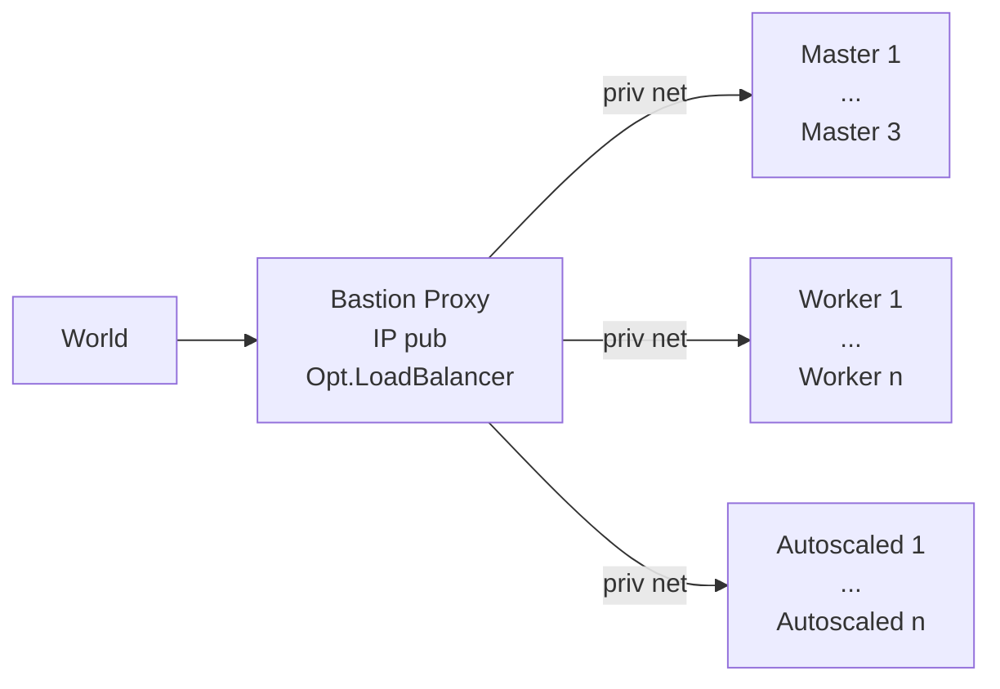

[](https://github.com/axgkl/hk3sf/actions/workflows/tests.yml)

# Hetzner K3s Functions

> A collection of functions to setup K3s clusters on [Hetzner Cloud][hcloud], based on vitobotta's [hetzner-k3s][hk3s]

## About

[Hetzner-k3s][hk3s] is nicely engineered general k3s installation tool on Hetzner, with a large degree of declarative possibilities for customization. As terraform, it is a single static binary and idempotent, with a single source of truth. In contrast to terraform it is straightforward to use, with far less abstractions but a lot of built in best practices, incl CNI and autoscaling, plus faster.

This repo here provides a set of **bash functions**, incl. possibly useful support tools to organize them, in order to further automate _around_ the pure k3s installation, which hetzner-k3s provides.

## Not a Wrapper

❗ This repo is **not** meant to be a convenience wrapper, to get you to **your** k3s setup. Unmodified it works for me - but it won't for you. It is _neither_ meant to relief you off the effort to learn the underlying machinery, nor from adding/adjusting code, to customize!

> As nearly always, [Prime nails it](https://youtu.be/EvzB_Q1gSds?t=54).

So: **Only** if you _anyway_ would automate your cluster setup using bash scripts, you might find this useful, as a starting point.

_You **will** have to modify the functions to your needs, e.g. provide dns provisioning for **your** provider, since you won't use the [built in one](../pkg/dns.sh) (DO) and/or supply [ingress setup](../pkg/ingress.sh) functions, when **not** using nginx and so on._  
What I _did_ aim for, is to make the places _where_ to customize as canonical as possible, plus provide blueprints, for _how_ to do it.

## Features

### Pre K3s Installation

Focus is on creating the cluster with private IPs only, and a _proxy_ server in front of them:



That bastion server is the only one with a public IP, and [can be equipped with a l4 loadbalancer](./docs/l4lb.md), forwarding the traffic into the cluster, like a hetzner loadbalancer would do.

💡 Using the bastion node as loadbalancer is optional. [hetzner-k3s][hk3s] does by default create hetzner loadbalancers for you, using the hetzner cloud controller manager (ccm).

[Here](./docs/l4lb.md) is a detailed description of the loadbalancer setup, incl. some reasons for it.

---

We provide the functions necessary to

- create the private network
- bastion node itself, with ssh key
- tools (hetzner-k3s, kubectl, helm) and [optional load balancer service](./docs/l4lb.md) on it
- cloud init config for hetzner-k3s, so that the priv ip nodes can reach the internet

Then hetzner-k3s can be run from there, to create the cluster.

### K3s Installation

From the proxy server, we then kick off hetzner-k3s, using a config we synthesized from the environ.

[Here](./docs/privip.md) are the details regarding a private IP only cluster setup.

### Post K3s Installation

We provide functions to

- transfer kubeconfig from the bastion to the local machine
- configure local ssh
- install cert-manager into the cluster
- install ingress-nginx into the cluster
- install services using that ingress into the cluster, in a way so that https traffic from the world can reach the application pods with
  - working certificates
  - optional pod affinity via cookie ("sticky sessions")
  - source ip preservation (using [proxy protocol](https://www.haproxy.org/download/1.8/doc/proxy-protocol.txt))
  - autoscaling support

## Usage

In general the script provides its functions after being sourced from a bash script _you_ provide and make executable.

See the ci [../tests/setup.sh](../tests/setup.sh) script for an example, which installs the full cluster from scratch.


💡 When you pass _arguments_ to that script, this results in an execution of the given function and exit of the script, w/o running the subsequent functions after sourcing.


General layout of your script is therefore:

```bash
CONFIGVAR1=CONFIGVAL1
...
source <dir>/main.sh "$@" # causes exit when an arg is passed, i.e. a function name

setup_function1
setup_function2
...
```

`yourscript -h` lists all available functions.

## CI Automation

See [here](./docs/ci.md)


## Customization

See [here](./docs/customization.md)

## Dev Details

[here](./docs/customization.md)

---

## Refs

- [notes](./docs/knowledge.md)

- <https://community.hetzner.com/tutorials/how-to-set-up-nat-for-cloud-networks>
- <https://github.com/vitobotta/hetzner-k3s>
- <https://github.com/vitobotta/hetzner-k3s/issues/379>
- <https://www.youtube.com/watch?v=u5l-F8nPumE&t=466s>
- <https://gimlet.io>

---

K3s with: HA + AutoScaling + GitOps from scratch. 💗 For < 20€/month if wanted.

[hk3s]: https://github.com/vitobotta/hetzner-k3s
[hcloud]: https://docs.hetzner.cloud/
