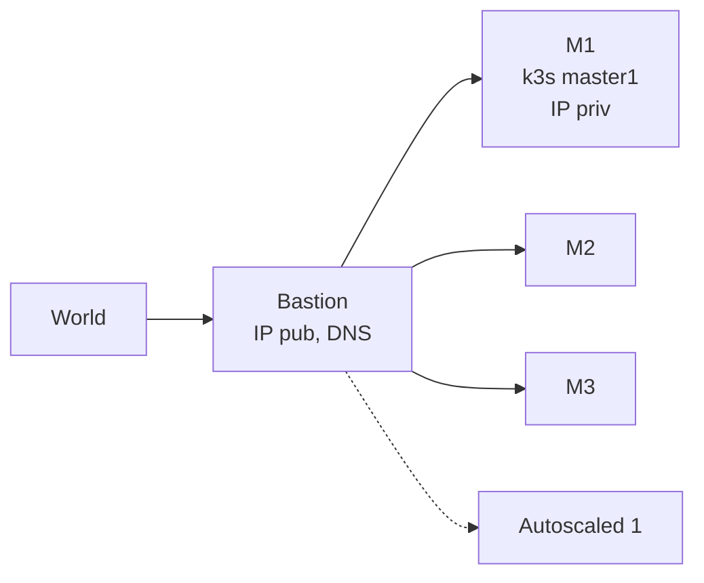

# K3s with: HA+AutoScaling+GitOps. For < 20€/month. From Scratch.

## Refs

- https://community.hetzner.com/tutorials/how-to-set-up-nat-for-cloud-networks
- https://github.com/vitobotta/hetzner-k3s
- https://github.com/vitobotta/hetzner-k3s/issues/379
- https://www.youtube.com/watch?v=u5l-F8nPumE&t=466s
- https://gimlet.io




### Topo: 3 Masters for k8s HA. No API LBs

Why: 

1. don't want to ever have to recover a broken k8s. So: 3.
2. => Workloads on (cheap) masters - but with **autoscaled** add/delete workers if required.

IPs: Priv IPs are for free -> Only 1 pub IP (on a bastion outside the k8s cluster, which runs trivially restorable services w/o k8s). Also more secure, only this to shield.

[Lets build the k3s cluster](./k3s.md)

## Play Time

If new to this world, check these:

- [ingress](./k8s_ingress.md)
- [autoscaling](./k8s_autoscaler.md)
- [csi](./k8s_csi.md)


Now check [here](./metal.md) regarding some pretty heavy metal stuff.  It's about how we wiped the need for a hetzner loadbalancer for services...

Edit: And it was in vain, see first paragraph there.

Now of the real solution regarding networking:

[Setting up networking](./netw.md)


https://www.haproxy.org/download/1.8/doc/proxy-protocol.txt

PROXY TCP4 192.168.0.1 192.168.0.11 56324 443
GET / HTTP/1.1
Host: 192.168.0.11
\r\n

SO_REUSEPORT in strace nc -l -p 80


## Gimlet

Best gitops flow, github works like a charm.
But we want company gitlab.

So:

In gitlab create an app, get the client id and secret.
🟥Redirect URL is:  http://127.0.0.1:9000/auth


```bash
wget https://raw.githubusercontent.com/gimlet-io/gimlet/main/fixtures/gimlet-helm-values.yaml
```

edit:

```yaml
image:
  repository: ghcr.io/gimlet-io/gimlet
  tag: v0.26.0
containerPort: 9000
probe:
  enabled: true
  path: /
vars:
  HOST: "http://127.0.0.1:9000"
  API_HOST: http://gimlet.default.svc.cluster.local:9000
  GITLAB_CLIENT_ID: "90a4...."
  GITLAB_CLIENT_SECRET: "gloas-b1..."
  GITLAB_ADMIN_TOKEN: "glpat-..."
  GITLAB_DEBUG: true
  GITLAB_ORG: "kl...."
  GITLAB_URL: "https://gitlab.....com"
(...)
```

```bash
helm template gimlet onechart/onechart -f gimlet-helm-values.yaml > manifest.yaml
k apply -f manifest.yaml
k port-forward svc/gimlet 9000:9000
```


See here for their example: https://gitlab.com/gimlet-io/gitlab-integration-sample/-/blob/main/.gimlet/debug-gis.yaml?ref_type=heads


## Todos

### Apps

#### ImgBGRmv
```
from rembg import remove
from PIL import Image

## Path for input and output image
input_img = 'monkey.jpg'
output_img = 'monkey_rmbg.png'

## loading and removing background
inp = Image.open(input_img)
output = remove(inp)

## Saving background removed image to same location as input image
output.save(output_img)
```


## Addendum

### hetzner-k3s

[Best](https://github.com/vitobotta/hetzner-k3s/issues/257#issuecomment-1657183124) tool, way better than terraform.

❗But keep an eye on [kops](https://kops.sigs.k8s.io/cli/kops/) - not yet ready for hetzner (no autoscaling).

How to hack the tool:

1. git clone repo
2. docker build Dockerfile.env -t hetzner-k3s # comment the stern go lib
3. run, export into fs, git clone again into /home/app/hetzner-k3s
4. nspawn -D <fs>
5. cd /home/app/hetzner-k3s
```bash
  …/gh/vitobotta/hetzner-k3s.fs❯ sudo systemd-nspawn -D .
Spawning container hetzner-k3s.fs on /home/gk/repos/gh/vitobotta/hetzner-k3s.fs.
hetzner-k3s:~# cd /home/app/hetzner-k3s/
hetzner-k3s:/home/app/hetzner-k3s# shards install
Resolving dependencies
Fetching https://github.com/jwaldrip/admiral.cr.git
 (...)
< change source code from outside>
hetzner-k3s:/home/app/hetzner-k3s# crystal build ./src/hetzner-k3s.cr --verbose --static
```

done

E.g. I added an output within the installer file for the k3s command and got:

```
=== Setting up Kubernetes ===
Deploying k3s to first master axc3-cx22-master1...
----------------------------
touch /etc/initialized
touch /myscript
export INSTALL_K3S_SKIP_DOWNLOAD=true
if [[ $(</etc/initialized) != "true" ]]; then
        systemctl restart NetworkManager || true
        dhclient eth1 -v || true
fi

HOSTNAME=$(hostname -f)
PRIVATE_IP=$(ip route get 10.0.0.0 | awk -F"src " 'NR==1{split($2,a," ");print a[1]}')
PUBLIC_IP=$(hostname -I | awk '{print $1}')
NETWORK_INTERFACE=$(ip route get 10.0.0.0 | awk -F"dev " 'NR==1{split($2,a," ");print a[1]}')

if [[ "false" = "true" ]]; then
        FLANNEL_SETTINGS=" --flannel-backend=none --disable-kube-proxy --disable-network-policy "
else
        FLANNEL_SETTINGS="   --flannel-iface=$NETWORK_INTERFACE "
fi

curl -sfL https://get.k3s.io | INSTALL_K3S_VERSION="v1.29.6+k3s2" K3S_TOKEN="e329e475c3867b283d54ed8306e5dff5"  INSTALL_K3S_EXEC="server \
--disable-cloud-controller \
--disable-network-policy \
--disable servicelb \
--disable traefik \
--disable local-storage \
--disable metrics-server \
--write-kubeconfig-mode=644 \
--node-name=$HOSTNAME \
--cluster-cidr=10.244.0.0/16 \
--service-cidr=10.43.0.0/16 \
--cluster-dns=10.43.0.10 \
--kube-controller-manager-arg="bind-address=0.0.0.0" \
--kube-proxy-arg="metrics-bind-address=0.0.0.0" \
--kube-scheduler-arg="bind-address=0.0.0.0" \
         --etcd-expose-metrics=true  $FLANNEL_SETTINGS \
--kubelet-arg="cloud-provider=external" \
--advertise-address=$PRIVATE_IP \
--node-ip=$PRIVATE_IP \
--node-external-ip=$PUBLIC_IP \
 --cluster-init  --tls-san=65.109.42.118 --tls-san=10.0.0.6 --tls-san=10.0.0.5 --tls-san=10.0.0.3 --tls-san=10.0.0.4" sh -

systemctl start k3s # on some OSes the service doesn't start automatically for some reason
````


### Checking Image Behaviour

This creates an instance of any available image:

```bash
token=$(pass show HCloud/token)

images=$(curl -H "Authorization: Bearer $token" "https://api.hetzner.cloud/v1/images" | jq -r '.images[].name')

for image in $images; do
	name="$(echo $image | tr '[:upper:]' '[:lower:]' | sed 's/[^a-z0-9-]/-/g' | cut -c 1-63)"
	echo "$name"

	curl -X POST \
		-H "Authorization: Bearer $token" \
		-H "Content-Type: application/json" \
		-d '{
    "name": "'$name'",
    "server_type": "cx11",
    "image": "'$image'",
    "location": "hel1",
    "ssh_keys": ["hcloud_key_root"]
  }' \
		"https://api.hetzner.cloud/v1/servers" | tee "$name"
	sleep 4
done
```

This loops over them, checking sth:

```bash
token=$(pass show HCloud/token)

curl -sH "Authorization: Bearer $token" "https://api.hetzner.cloud/v1/servers" | jq -r '.servers[] | "\(.name) \(.public_net.ipv4.ip)"' | while read name ip; do
        echo "Name: $name"
        echo "IP: $ip"
done
ips=$(curl -H "Authorization: Bearer $token" "https://api.hetzner.cloud/v1/servers" | jq -r '.servers[].public_net.ipv4.ip')
for ip in $ips; do
        echo "$ip"
        /usr/bin/ssh -o UserKnownHostsFile=/dev/null -o StrictHostKeyChecking=no root@$ip ls -lta /var/lib/cloud/instance/boot-finished 2>/dev/null
done
```


