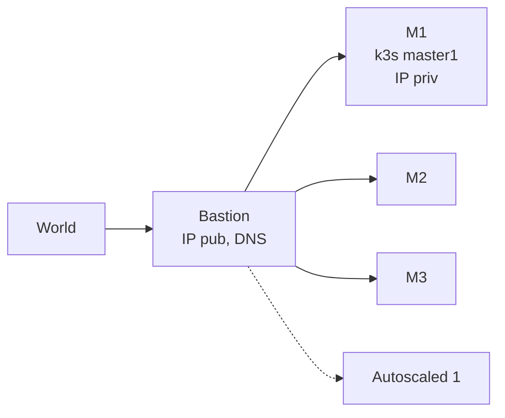

# K3s with: HA+AutoScaling+GitOps. For < 20€/month. From Scratch.

## Refs

- https://community.hetzner.com/tutorials/how-to-set-up-nat-for-cloud-networks
- https://github.com/vitobotta/hetzner-k3s
- https://github.com/vitobotta/hetzner-k3s/issues/379
- https://gimlet.io




### Topo: 3 Masters for k8s HA. No API LBs

Why: 

1. don't want to ever have to recover a broken k8s. So: 3.
2. => Workloads on cheap masters - but with autoscaled add/delete workers if required.

IPs: Priv IPs are for free -> Only 1 pub IP (on a bastion outside the k8s cluster, which runs trivially restorable services w/o k8s). Also more secure, only this to shield.

### [hetzner-k3s](https://github.com/vitobotta/hetzner-k3s)
The default, way better than terraform. BUT: Did not run on my fedora, so:

- Built the tool from source: https://github.com/vitobotta/hetzner-k3s/issues/309#issuecomment-2080853984
- Moved to /usr/local/bin/hetzner-k3s

We start from an empty project.

## Private Network

In cloud console UI, create 'ten-0' private network, 10.0.0.0/16

## Bastion Host

The one host with a pub v4 IP (50cents/mo)

### Create it

Using hetzner gui, lowest priced amd server, ubuntu 22, hostname **bastion**.

### Make it a proxy

I know - but I'll find it easier to do it this way:


```ini
[Unit]
Description=Bastion Proxy

[Service]
Type=oneshot
ExecStart=/bin/bash -c 'echo 1 > /proc/sys/net/ipv4/ip_forward'
ExecStart=/bin/bash -c 'iptables -t nat -A POSTROUTING -s '10.0.0.0/16' -o eth0 -j MASQUERADE'

[Install]
WantedBy=multi-user.target

```

Then `systemctl enable bastion_proxy`

### Secure it

- ssh port away from 22 in /etc/ssh/sshd_config
- paswd auth off

```bash
apt update
apt install unattended-upgrades
apt install update-notifier-common
systemctl enable unattended-upgrades
systemctl start unattended-upgrades
apt install fail2ban
cat .ssh/authorized_keys > /tmp/k
adduser admin
su - admin
ssh-keygen
cat /tmp/k > .ssh/authorized_keys
exit
reboot # (systemctl restart sshd was not available)
```


### Pet it

As user admin:

Install <a href="https://github.com/devops-works/binenv">binenv</a> (just copy and paste the installer script into your shell).


Install at least kubectl:

`for i in kubectl kubens kubectx k9s; do binenv install $i; done` 

## K3s Cluster

### Prepare
On bastion

1. Add your ssh.pub key to `https://console.hetzner.cloud/projects/<your project>/security/sshkeys`

2. Install [hetzner-k3s](https://github.com/vitobotta/hetzner-k3s)

Not yet in binenv, so:

```bash
wget https://github.com/vitobotta/hetzner-k3s/releases/download/v1.1.5/hetzner-k3s-linux-arm64
chmod +x hetzner-k3s-linux-arm64
sudo mv hetzner-k3s-linux-arm64 /usr/local/bin/hetzner-k3s
mkdir axc3
```


### Configure cluster

First create a project space only api token and put it into environ, e.g.: `admin@bastion:~/axc3$ cat environ -> export HCLOUD_TOKEN="NQkec...." + source ./environ`

<details><summary> config.yaml: </summary>

```yaml
---
cluster_name: axc3
kubeconfig_path: "./kubeconfig"
k3s_version: v1.30.2+k3s2
public_ssh_key_path: "~/.ssh/id_rsa.pub"
private_ssh_key_path: "~/.ssh/id_rsa"
use_ssh_agent: false # set to true if your key has a passphrase or if SSH connections don't work or seem to hang without agent. See https://github.com/vitobotta/hetzner-k3s#limitations
ssh_port: 22
ssh_allowed_networks:
  - 10.0.0.0/16
  - 157.90.174.84/32
api_allowed_networks:
  - 10.0.0.0/16 # ensure your current IP is included in the range
  - 157.90.174.84/32
private_network_subnet: 10.0.0.0/16 # ensure this doesn't overlap with other networks in the same project
disable_flannel: false # set to true if you want to install a different CNI
schedule_workloads_on_masters: true
# cluster_cidr: 10.244.0.0/16 # optional: a custom IPv4/IPv6 network CIDR to use for pod IPs
# service_cidr: 10.43.0.0/16 # optional: a custom IPv4/IPv6 network CIDR to use for service IPs. Warning, if you change this, you should also change cluster_dns!
# cluster_dns: 10.43.0.10 # optional: IPv4 Cluster IP for coredns service. Needs to be an address from the service_cidr range
enable_public_net_ipv4: false # default is true
enable_public_net_ipv6: true # default is true
# image: rocky-9 # optional: default is ubuntu-22.04
# autoscaling_image: 103908130 # optional, defaults to the `image` setting
# snapshot_os: microos # optional: specified the os type when using a custom snapshot
# cloud_controller_manager_manifest_url: "https://github.com/hetznercloud/hcloud-cloud-controller-manager/releases/download/v1.19.0/ccm-networks.yaml"
# csi_driver_manifest_url: "https://raw.githubusercontent.com/hetznercloud/csi-driver/v2.6.0/deploy/kubernetes/hcloud-csi.yml"
# system_upgrade_controller_deployment_manifest_url: "https://github.com/rancher/system-upgrade-controller/releases/download/v0.13.4/system-upgrade-controller.yaml"
# system_upgrade_controller_crd_manifest_url: "https://github.com/rancher/system-upgrade-controller/releases/download/v0.13.4/crd.yaml"
# cluster_autoscaler_manifest_url: "https://raw.githubusercontent.com/kubernetes/autoscaler/master/cluster-autoscaler/cloudprovider/hetzner/examples/cluster-autoscaler-run-on-master.yaml"
datastore:
  mode: etcd 
masters_pool:
  instance_type: cx22
  instance_count: 3
  location: hel1

worker_node_pools:
    #  - name: small-static
    #   instance_type: cx32
    #   instance_count: 3
    #   location: hel1
    # image: debian-11
    # labels:
    #   - key: purpose
    #     value: blah
    # taints:
    #   - key: something
    #     value: value1:NoSchedule

  - name: big-autoscaled
    instance_type: cx42
    instance_count: 2
    location: hel1
    autoscaling:
      enabled: true
      min_instances: 0
      max_instances: 3

additional_packages:
 - ifupdown
post_create_commands:
  - ip route add default via 10.0.0.1
  - timedatectl set-timezone Europe/Berlin
  - mkdir -p /etc/network/interfaces.d
  - printf "auto enp7s0\niface enp7s0 inet dhcp\n    post-up ip route add default via 10.0.0.1\n" > /etc/network/interfaces.d/enp7s0
  - rm /etc/resolv.conf
  - echo 'nameserver 185.12.64.1' > /etc/resolv.conf
  - echo 'nameserver 185.12.64.2' >> /etc/resolv.conf
  - echo 'edns edns0 trust-ad' >> /etc/resolv.conf
  - echo 'search .' >> /etc/resolv.conf


enable_encryption: false
existing_network: ten-0
#api_server_hostname: k3s1.axlc.net # optional: DNS for the k8s API LoadBalancer. After the script has run, create a DNS record with the address of the API LoadBalancer.
```

</details>


### Install cluster

`hetzner-k3s create --config config.yaml`

#### In case of failure

##### On STDIN failure (happens sometimes)

Run this: 

```bash
export ver='v1.29.6+k3s2' master="10.0.0.3" # set to first master
echo 'curl -sfL https://get.k3s.io | INSTALL_K3S_VERSION="$ver" sh - && systemctl stop k3s && rm -f /etc/initialized' | ssh root@$master bash
```

See [here](https://github.com/vitobotta/hetzner-k3s/issues/379) for more about that

##### Fix If system-upgrade-controller is not running:

```bash
kubectl apply -f https://github.com/rancher/system-upgrade-controller/releases/latest/download/system-upgrade-controller.yaml
```

(fixing [this rancher problem](https://github.com/rancher/system-upgrade-controller/issues/302))


### ssh config

With this in bastion's .ssh/config you can easily ssh into the masters:

```bash
admin@bastion:~/axc3$ cat $HOME/.ssh/config
Host m1
  HostName 10.0.0.5
  User root
Host m2
  HostName 10.0.0.3
  User root
Host m3
  HostName 10.0.0.4
  User root
```

IPs from the hetzner cloud UI.


### Celebrate

```
admin@bastion:~/axc3$ k get pods -A
NAMESPACE        NAME                                               READY   STATUS    RESTARTS   AGE
kube-system      cluster-autoscaler-84fd54d697-jqrsm                1/1     Running   0          16m
kube-system      coredns-576bfc4dc7-hd928                           1/1     Running   0          16m
kube-system      hcloud-cloud-controller-manager-7c697b4d54-tzt87   1/1     Running   0          16m
kube-system      hcloud-csi-controller-d97f9f5cd-swh2c              5/5     Running   0          16m
kube-system      hcloud-csi-node-2mphv                              3/3     Running   0          16m
kube-system      hcloud-csi-node-2p66j                              3/3     Running   0          15m
kube-system      hcloud-csi-node-wb6ql                              3/3     Running   0          16m
system-upgrade   system-upgrade-controller-7894d5bb99-p5czj         1/1     Running   0          6m22s
```

## Delete Kubectl API Loadbalancer

hetnzer-k3s does create an API Loadbalancer. Costs 8 Euros/month. Delete it, via the cloud console.
The cluster does not require that.

## Continue On Laptop

We did add our ssh key to all nodes, so we can jump on them via bastion.

### Tools

Install [binenv](https://github.com/devops-works/binenv). Then:

```bash
for t in kubectl kubens kubectx k9s helm; do binenv install $t; done
```


### ssh config

#### On Laptop

These are my (veery short) hostnames for the masters, via bastion ("b"). Adapt to your likings but you might see them in screenshots later.

```bash
Host b
  Hostname 37.27.42.244
  User admin
  LocalForward 6443 10.0.0.3:6443 # for kubectl

Host m1
  HostName 10.0.0.5
  User root
  ProxyCommand ssh -W %h:%p b

Host m2
  HostName 10.0.0.3
  User root
  ProxyCommand ssh -W %h:%p b

Host m3
  HostName 10.0.0.4
  User root
  ProxyCommand ssh -W %h:%p b
```

💡Yes, harcoded 10.0.0.3 - We could also tcp round robin balance from bastion to the 3 masters but its not worth the effort - when a master fails, go to another one via this .ssh/config. And hey, you do want to know when it fails, no?
Plus, you save 8 Euro/month, thanks to this.

```bash
export KUBECONFIG=~/axc3/kubeconfig # whereever it is, e.g. into your "bashrc"
mkdir -p ~/axc3 && cd $_
```

Now copy kubeconfig and replace the LB IP (which you deleted) in kubeconfig with 127.0.0.1 via the portforward configured in your ssh config. I do it via a function, since I did it often:

```bash
[gk@axgk axc3]$ cat environ
echo -e '
ssh b to enable the portforwarding to the bastion host.
💡getkubconfig copies it from bastion
'

function getkubeconfig {
  scp b:kubeconfig .
  sed -i 's|https://[^:]*:|https://127.0.0.1:|' ./kubeconfig
}
```

Try k9s now - you have your cluster.

If new to this world, check these:

- [ingress](./k8s_ingress.md)
- [csi](./k8s_csi.md)
- [autoscaling](./k8s_autoscaler.md)


## Gimlet

Best gitops flow, github works like a charm.
But we want company gitlab.

So:

In gitlab create an app, get the client id and secret.
🟥Redirect URL is:  http://127.0.0.1:9000/auth


```bash
wget https://raw.githubusercontent.com/gimlet-io/gimlet/main/fixtures/gimlet-helm-values.yaml
```

edit:

```yaml
image:
  repository: ghcr.io/gimlet-io/gimlet
  tag: v0.26.0
containerPort: 9000
probe:
  enabled: true
  path: /
vars:
  HOST: "http://127.0.0.1:9000"
  API_HOST: http://gimlet.default.svc.cluster.local:9000
  GITLAB_CLIENT_ID: "90a4...."
  GITLAB_CLIENT_SECRET: "gloas-b1..."
  GITLAB_ADMIN_TOKEN: "glpat-..."
  GITLAB_DEBUG: true
  GITLAB_ORG: "kl...."
  GITLAB_URL: "https://gitlab.....com"
(...)
```

```bash
helm template gimlet onechart/onechart -f gimlet-helm-values.yaml > manifest.yaml
k apply -f manifest.yaml
k port-forward svc/gimlet 9000:9000
```


See here for their example: https://gitlab.com/gimlet-io/gitlab-integration-sample/-/blob/main/.gimlet/debug-gis.yaml?ref_type=heads


## Todos

### Apps

#### ImgBGRmv
```
from rembg import remove
from PIL import Image

## Path for input and output image
input_img = 'monkey.jpg'
output_img = 'monkey_rmbg.png'

## loading and removing background
inp = Image.open(input_img)
output = remove(inp)

## Saving background removed image to same location as input image
output.save(output_img)
```


## Addendum

### hetzner-k3s

[Best](https://github.com/vitobotta/hetzner-k3s/issues/257#issuecomment-1657183124) tool, way better than terraform.

How to hack the tool:

1. git clone repo
2. docker build Dockerfile.env -t hetzner-k3s # comment the stern go lib
3. run, export into fs, git clone again into /home/app/hetzner-k3s
4. nspawn -D <fs>
5. cd /home/app/hetzner-k3s
```bash
  …/gh/vitobotta/hetzner-k3s.fs❯ sudo systemd-nspawn -D .
Spawning container hetzner-k3s.fs on /home/gk/repos/gh/vitobotta/hetzner-k3s.fs.
hetzner-k3s:~# cd /home/app/hetzner-k3s/
hetzner-k3s:/home/app/hetzner-k3s# shards install
Resolving dependencies
Fetching https://github.com/jwaldrip/admiral.cr.git
 (...)
< change source code from outside>
hetzner-k3s:/home/app/hetzner-k3s# crystal build ./src/hetzner-k3s.cr --verbose --static
```

done

E.g. I added an output within the installer file for the k3s command and got:

```
=== Setting up Kubernetes ===
Deploying k3s to first master axc3-cx22-master1...
----------------------------
touch /etc/initialized
touch /myscript
export INSTALL_K3S_SKIP_DOWNLOAD=true
if [[ $(</etc/initialized) != "true" ]]; then
        systemctl restart NetworkManager || true
        dhclient eth1 -v || true
fi

HOSTNAME=$(hostname -f)
PRIVATE_IP=$(ip route get 10.0.0.0 | awk -F"src " 'NR==1{split($2,a," ");print a[1]}')
PUBLIC_IP=$(hostname -I | awk '{print $1}')
NETWORK_INTERFACE=$(ip route get 10.0.0.0 | awk -F"dev " 'NR==1{split($2,a," ");print a[1]}')

if [[ "false" = "true" ]]; then
        FLANNEL_SETTINGS=" --flannel-backend=none --disable-kube-proxy --disable-network-policy "
else
        FLANNEL_SETTINGS="   --flannel-iface=$NETWORK_INTERFACE "
fi

curl -sfL https://get.k3s.io | INSTALL_K3S_VERSION="v1.29.6+k3s2" K3S_TOKEN="e329e475c3867b283d54ed8306e5dff5"  INSTALL_K3S_EXEC="server \
--disable-cloud-controller \
--disable-network-policy \
--disable servicelb \
--disable traefik \
--disable local-storage \
--disable metrics-server \
--write-kubeconfig-mode=644 \
--node-name=$HOSTNAME \
--cluster-cidr=10.244.0.0/16 \
--service-cidr=10.43.0.0/16 \
--cluster-dns=10.43.0.10 \
--kube-controller-manager-arg="bind-address=0.0.0.0" \
--kube-proxy-arg="metrics-bind-address=0.0.0.0" \
--kube-scheduler-arg="bind-address=0.0.0.0" \
         --etcd-expose-metrics=true  $FLANNEL_SETTINGS \
--kubelet-arg="cloud-provider=external" \
--advertise-address=$PRIVATE_IP \
--node-ip=$PRIVATE_IP \
--node-external-ip=$PUBLIC_IP \
 --cluster-init  --tls-san=65.109.42.118 --tls-san=10.0.0.6 --tls-san=10.0.0.5 --tls-san=10.0.0.3 --tls-san=10.0.0.4" sh -

systemctl start k3s # on some OSes the service doesn't start automatically for some reason
````


### Checking Image Behaviour

This creates an instance of any available image:

```bash
token=$(pass show HCloud/token)

images=$(curl -H "Authorization: Bearer $token" "https://api.hetzner.cloud/v1/images" | jq -r '.images[].name')

for image in $images; do
	name="$(echo $image | tr '[:upper:]' '[:lower:]' | sed 's/[^a-z0-9-]/-/g' | cut -c 1-63)"
	echo "$name"

	curl -X POST \
		-H "Authorization: Bearer $token" \
		-H "Content-Type: application/json" \
		-d '{
    "name": "'$name'",
    "server_type": "cx11",
    "image": "'$image'",
    "location": "hel1",
    "ssh_keys": ["hcloud_key_root"]
  }' \
		"https://api.hetzner.cloud/v1/servers" | tee "$name"
	sleep 4
done
```

This loops over them, checking sth:

```bash
token=$(pass show HCloud/token)

curl -sH "Authorization: Bearer $token" "https://api.hetzner.cloud/v1/servers" | jq -r '.servers[] | "\(.name) \(.public_net.ipv4.ip)"' | while read name ip; do
        echo "Name: $name"
        echo "IP: $ip"
done
ips=$(curl -H "Authorization: Bearer $token" "https://api.hetzner.cloud/v1/servers" | jq -r '.servers[].public_net.ipv4.ip')
for ip in $ips; do
        echo "$ip"
        /usr/bin/ssh -o UserKnownHostsFile=/dev/null -o StrictHostKeyChecking=no root@$ip ls -lta /var/lib/cloud/instance/boot-finished 2>/dev/null
done
```

