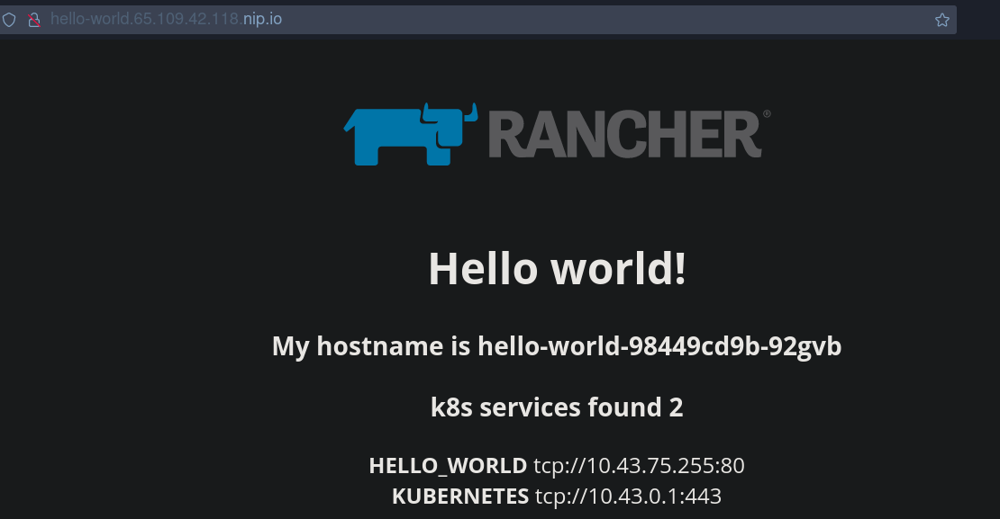
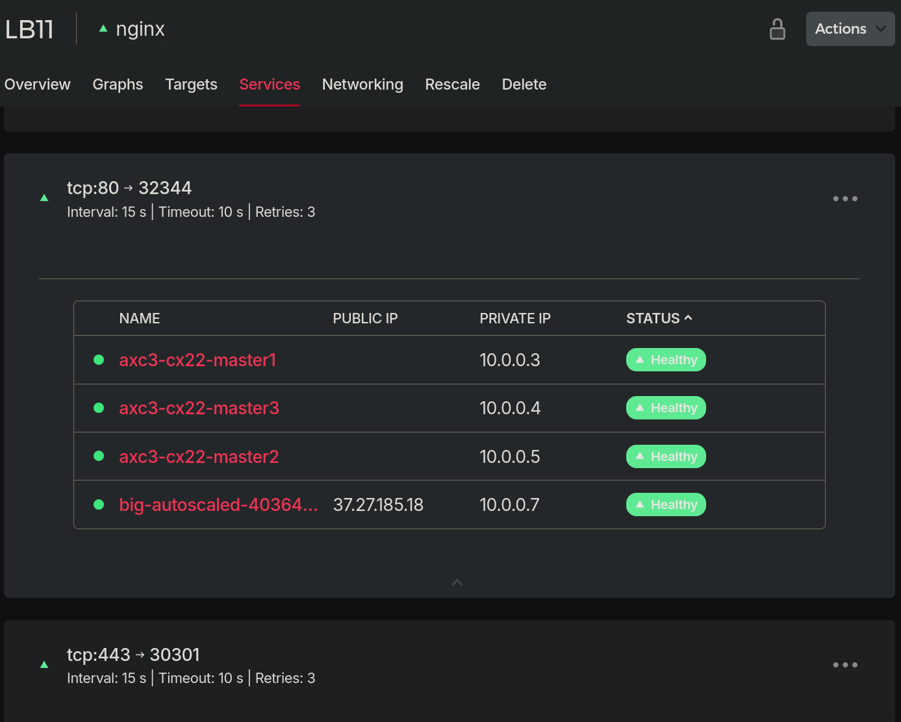

# Understand Ingress

[setup](./deploys/hello_ingress_tutorial/)

Create a hello service (the rancher echo service) like shown [here](https://github.com/vitobotta/hetzner-k3s/blob/main/wiki/Setting%20up%20a%20cluster.md) 

It created a LB using https://github.com/hetznercloud/hcloud-cloud-controller-manager

## Findings
- When checking it on hetzner UI, we see it's just a simple tcp load balancer, to the 10.0.0.x node ips, e.g. to 10.4, 2 ports (for 80 and 443), but using different ports, here 32443 
- via bastion ssh to 10.4., tcpdump, make requests, see traffic to 10.4:34443
- but netstat or ss shows: There is **no** unix process on the machine bound to this port 
- solution: `iptables -L -n -t nat`

```bash
root@axc3-cx22-master3:~# ps ax | grep nginx | grep -v grep | wc -l
8
root@axc3-cx22-master3:~# iptables -L -n -t nat | wc -l
271
root@axc3-cx22-master3:~# iptables -L -n -t nat | grep 32344
KUBE-EXT-CG5I4G2RS3ZVWGLK  tcp  --  0.0.0.0/0            0.0.0.0/0            /* ingress-nginx/ingress-nginx-controller:http */ tcp dpt:32344
```

💡This is how they do it! And no, I can't reach that 32344 from bastion, only from the lb.

