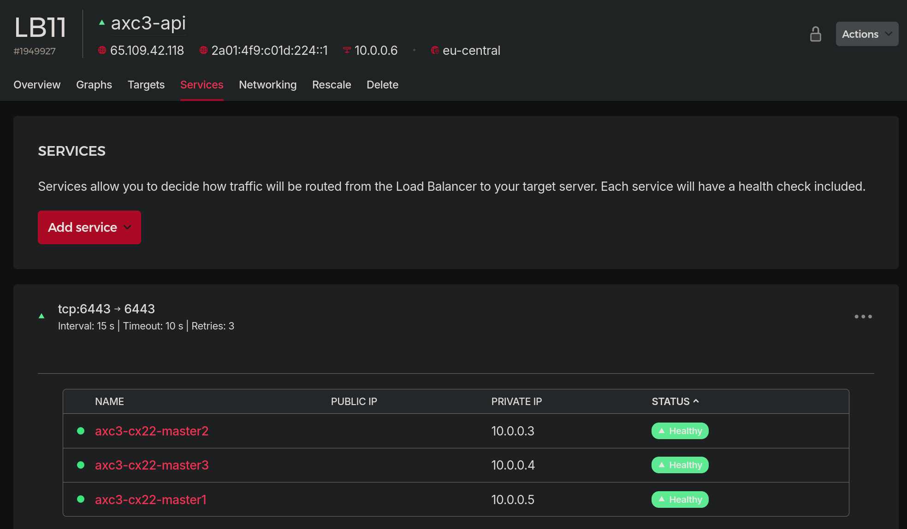

# Removing the Need for Hetzner LB

❗The following was all in vain.

> We did solve the problem of ingress external IP in pending state, getting metallb with a config for our public bastion IP, to tell the ingress about that IP. 

> Our services then worked - **BUT** they did not show the source ip of the requests.
To get to these **proxy protocol** is key, which metallb is NOT the right tool for. 

> More here: https://github.com/metallb/metallb/issues/797#issuecomment-2237484248
> Proxy protocol is configured in the next chapter and the config works even w/o metallb.

> I do leave this here for your possibly future reference.

---

Deployment is [here](./deploys/metal_lb/)

> Your company loves you! Pay it back. 

Get rid of another item on the monthly bill. PLUS: We do want a setup which does NOT depend on components of our cloud infra provider, but should work on premise just the same.

Reminder: hetzner-k3s did create a dedicated kube _API Loadbalancer_, for our three master nodes. Would cost 8 Euros/month - and is really not doing much:



That one was easy: We simply **deleted** it. Replaced it by a portforward, over bastion, to the first master, for the kubectl commands from outside.

💡 Only the ppl., who get bastion ssh access can now use kubectl on our cluster.

----

But: there is **another** LB [being created](https://github.com/vitobotta/hetzner-k3s/blob/main/wiki/Setting%20up%20a%20cluster.md), on "normal" k8s clusters on hetzner: For the **services** within our cluster. Configured via service annotations, triggering the [Hetzner CCM](https://github.com/hetznercloud/hcloud-cloud-controller-manager/blob/main/hcloud/load_balancers.go) to create it, using the normal hetzner API.

Which would be another 8Euro/month, for simple TCP forwarding rules. 
We don't want that. We already have our bastion node, with a public IP.

Getting rid of that one is a bit trickier. You have to understand a thing or two for this. I didn't:

## The Way to Enlightenment

First I was thinking that there *must* be some linux software, which has an api available for a kubernetes ingress controller, so that those can set these simple tcp forwarding rules, just like hetzner CCM does with **their** LB.

There [were others](https://dgraph.io/blog/post/building-a-kubernetes-ingress-controller-with-caddy/) with the idea to build a controller which does custom things - but it looks like there is nothing serious around.


So: **Include** the bastion node into the cluster, as an agent, so that more tools are available. That was straight forward:

Here a script which does it, for my setup, from the laptop - adapt for yours:

```bash
function getkubeconfig {
	scp b:kubeconfig .
	sed -i 's|https://[^:]*:|https://127.0.0.1:|' ./kubeconfig
	rm -f "$HOME/.kubeconfig"
	ln -s "$(pwd)/kubeconfig" "$HOME/.kubeconfig"
	kubectl get nodes
}

function bastion_into_cluster {
	echo '💡 This function requires local ssh configs for: broot (root@bastion) and m1 (root@master) and eth0 at a public IP on broot, enp7s0 with 10.0.0.2'
	token=$(ssh m1 "cat /var/lib/rancher/k3s/server/node-token") || return
	ssh broot ifconfig | grep -A 2 eth0 | grep inet | xargs | cut -d ' ' -f 2 >ippub || return
	ip="$(ssh broot ifconfig | grep -A 2 eth0 | grep inet | xargs | cut -d ' ' -f 2)"
	hostname="$(ssh broot cat /etc/hostname)" # ! must be the nodename in k8s as well!!
	ver="$(kubectl version | grep Server | cut -d ':' -f2 | xargs)" || return
	echo -e "k8s ver: $ver\nhostname: $hostname\nip: $ip\ntoken: $token\n"
	local i='(k3s-agent-uninstall.sh || true); curl -sfL https://get.k3s.io | INSTALL_K3S_VERSION="'$ver'"'
	i=''$i' K3S_URL=https://10.0.0.4:6443 K3S_TOKEN="'$token'" INSTALL_K3S_EXEC="agent --node-name="'$hostname'" '
	i=''$i' --kubelet-arg=cloud-provider=external --node-ip=10.0.0.2 --node-external-ip='$ip' --flannel-iface=enp7s0" sh -'
	echo "$i" >inst
	cat inst
	echo "ok to run this on bastion node?"
	read key
	chmod +x inst
	scp inst broot:
	rm inst
	ssh broot ./inst || { echo '🚨Failed to install agent!'; return 1; }
	kubectl get nodes
}

main() {
	case "$1" in
	1 | getkubconfig) getkubeconfig ;;
	2 | bastion_into_cluster) bastion_into_cluster ;;
	*) echo "Usage: $exe {getkubconfig|bastion_into_cluster}" && exit 1 ;;
	esac
}

main "$@"
```

📓 The kubelet args for k3s I got from an autoscaled agent only node's unit file.

Ok, so bastion is now a member of the cluster.

```bash
  …/gitops/docs❯ k get nodes -o wide                                                                                           ✘!?
NAME                STATUS   ROLES                       AGE     VERSION        INTERNAL-IP   EXTERNAL-IP    OS-IMAGE             KERNEL-VERSION       CONTAINER-RUNTIME
bast                Ready    <none>                      7h25m   v1.30.2+k3s2   10.0.0.2      95.217.1.185   Ubuntu 24.04 LTS     6.8.0-38-generic     containerd://1.7.17-k3s1
(...)
```

And the external IP is known to k8s 🤞. 


So, naively🤦, I installed [this](https://github.com/caddyserver/ingress), forced via a Node Selector onto bast, and expected a working loadbalancer - but no.

Output of a `k describe service` for the service delivered:

```
                                                                                                                   
  Gk ───                                                                                                          
                                                                                                                   
Name:                     axcaddy-caddy-ingress-controller                                                         
│ Namespace:                caddy-system                                                                           
│ Labels:                   app.kubernetes.io/instance=axcaddy                                                     
│                           app.kubernetes.io/managed-by=Helm                                                      
│                           app.kubernetes.io/name=caddy-ingress-controller                                        
│                           app.kubernetes.io/version=v0.2.1                                                       
│                           helm.sh/chart=caddy-ingress-controller-1.1.0                                           
│ Annotations:              <none>                                                                                 
│ Selector:                 app.kubernetes.io/instance=axcaddy,app.kubernetes.io/name=caddy-ingress-controller     
│ Type:                     LoadBalancer                                                                           
│ IP Family Policy:         SingleStack                                                                            
│ IP Families:              IPv4                                                                                   
│ IP:                       10.43.192.228                                                                          
│ IPs:                      10.43.192.228                                                                          
│ Port:                     http  80/TCP                                                                           
│ TargetPort:               http/TCP                                                                               
│ NodePort:                 http  30435/TCP                                                                        
│ Endpoints:                10.244.7.10:80,10.244.7.9:80                                                           
│ Port:                     https  443/TCP                                                                         
│ TargetPort:               https/TCP                                                                              
│ NodePort:                 https  31983/TCP                                                                       
│ Endpoints:                10.244.7.10:443,10.244.7.9:443                                                         
│ Session Affinity:         None                                                                                   
│ External Traffic Policy:  Cluster                                                                                
```

Where is the pub IP!?


## Cluster IP, Node Port, External IP:

Remember: **stuff is running in containers**! Containers which must be movable around the cluster.

A svc on port 80 inside can never be bound to port 80 **outside**, on the nodes where it is running. 

Skim over [this](./k8s_ingress.md). That 32334 port, the Hetzner LB was forwarding port 80 traffic to, is the so called Node Port, which forwards traffic *into* the container, to port 80.

- 💡 On which nodes you ask? Answer: On ALL Nodes!
- 💡 And, even better, reachable by ONE IP, the ClusterIP of that service. Throughout the whole cluster! Via pretty crazy iptables prerouting rules on all nodes...

```
iptroot@95:~# iptables -L -n -t nat | wc -l
201
```

Btw: eBPF is a newer alternative, used by cilium, but iptables is still the default in k3s.


Anyway, this "ClusterIP", which any `kind: service` gets allocated, is which cluster internal DNS trivially maps `<svcname>.<namespace>.cluster.local` DNS queries to :-)

That concept allows pods to be moved around over nodes and scaled up and down, w/o breaking the apps. It's really really powerful.

But, no such thing as a free lunch: You can't, from an app within a container (like caddy), simply bind to the node's 'physical' real external IP, like I thought it would happen when I install it into the cluster, with a hard node selector to this one node with that ip.

The "You can get the external IP address with `kubectl get svc -n caddy-system"` always delivered "pending" - and not the bastion pub IP. And now we understand a bit, why this can't work so simple, right?

Read [here](https://www.tkng.io/services/nodeport/) if you really want to know.

In any case: What you get as EXTERNAL ip, when k-getting a **service**, that is typically not accessible for k8s directly. But transferred into the cluster from outside. Maybe by means of routing protocols but prbly via APIs for CCMS, from the external loadbalancers of infra providers, like AWS or hetzner.


## Meet Metal LB 🌈

That's the answer to all of this. An LB which speaks these routing protos - but also understands k8s. So you don't need a CCM to address it. It can find out automagically.


> MetalLB itself doesn't listen on any specific port. Instead, it assigns
> external IP addresses to services of type `LoadBalancer`, and these services
> can listen on any port as defined in their configuration. The actual ports
> that are open and listening would depend on the configuration of these
> `LoadBalancer` services in your cluster.


### Interlude: Meet Outdated Manifests 󱕼

That's also something to get used to.

Background: In [long long 'chat'](./media/cp_metal.txt) with susi (karen?) I learned about using metallb (the hard way).

She gave me this:

        1. **Install MetalLB** on your cluster:

            ```bash
            kubectl apply -f https://raw.githubusercontent.com/metallb/metallb/v0.11.0/manifests/namespace.yaml
            kubectl apply -f https://raw.githubusercontent.com/metallb/metallb/v0.11.0/manifests/metallb.yaml
            ```

        2. **Create a secret** for the MetalLB speaker:

            ```bash
            kubectl create secret generic -n metallb-system memberlist --from-literal=secretkey="$(openssl rand -base64 128)"
            ```

        3. **Configure MetalLB** with a ConfigMap:

            ```yaml
            apiVersion: v1
            kind: ConfigMap
            metadata:
              namespace: metallb-system
              name: config
            data:
              config: |
                address-pools:
                - name: default
                  protocol: layer2
                  addresses:
                  - 95.217.1.185/32
            ```

            Replace `95.217.1.185/32` with the public IP of your `bast` node. This ConfigMap configures MetalLB to use Layer 2 mode and assigns it a single IP address, which is the public IP of your `bast` node.


And it worked like a charm, the caddy service picked it up and presented it's shiney new external IP, as handed to him, from metallb.

Output of `kubectl logs -l app=metallb -n metallb-system --tail=200 -f`:

```json
{"caller":"level.go:63","event":"ipAllocated","ip":"95.217.1.185","level":"info","msg":"IP address assigned by controller","service":"caddy-system/axcaddy-caddy-ingress-controller","ts":"2024-07-18T11:49:56.450992451Z"}
{"caller":"level.go:63","event":"serviceUpdated","level":"info","msg":"updated service object","service":"caddy-system/axcaddy-caddy-ingress-controller","ts":"2024-07-18T11:49:56.472096518Z"}
{"caller":"level.go:63","event":"serviceAnnounced","ip":"95.217.1.185","level":"info","msg":"service has IP, announcing","pool":"default","protocol":"layer2","service":"caddy-system/axcaddy-caddy-ingress-controller","ts":"2024-07-18T11:49:56.476532581Z"}
{"caller":"level.go:63","level":"info","msg":"triggering discovery","op":"memberDiscovery","ts":"2024-07-18T11:50:09.806360806Z"}
```


I loved it all.

Then downhill again. 


For this write up here, I clearly wanted the 'normal' way: 


```bash
helm repo add metallb https://metallb.github.io/metallb
helm install metallb metallb/metallb
```

and naively assumed the config map for the version above would still work:


```yaml
  > cat metallb_configmap_manifest.yaml
apiVersion: v1
kind: ConfigMap
metadata:
  namespace: metallb-system
  name: config
data:
  config: |
    address-pools:
    - name: default
      protocol: layer2
      addresses:
      - 95.217.1.185/32
```

Feels terrible when nothing happens. Caddy remained without the IP.

Investigating time: Converted this to helm values and applied. 

Helm told me the compat issue, with [URL](https://metallb.universe.tf/configuration/migration_to_crds/)

**ConfigMap is deprecated, use CRs[^cr].**


Oh and btw: Never forget to use `--privileged` when having aliased docker to podman and trying to generate files on mounted volumes, plus the tool just silent on errors :-/

Other than that, it is a nice tool. Here is what it built from our single pub IP config:


```

# This was autogenerated by MetalLB's custom resource generator.
apiVersion: metallb.io/v1beta1
kind: IPAddressPool
metadata:
  creationTimestamp: null
  name: default
  namespace: metallb-system
spec:
  addresses:
  - 95.217.1.185/32
status: {}
---
apiVersion: metallb.io/v1beta1
kind: L2Advertisement
metadata:
  creationTimestamp: null
  name: l2advertisement1
  namespace: metallb-system
spec:
  ipAddressPools:
  - default
status: {}
---
```

Looks like services can declare their own 'kinds' now, for structured data.


- 💡 Lesson: To find compat problems, it's better to work with helm than with kubectl and yamls.
- 💡 Bigger Lesson: K8s is a rollcoaster ride. I'm constantly in between admiration and doubts if it is really necessary and not tech overkill.... Be prepared for a ups and downs.

-----

### Moving On

Lets continue with our caddy ip:

After applying those Custom Resources we got this, within < 2 seconds:


```
$ k describe service axcaddy-caddy-ingress-controller  -n caddy-system
Name:                     axcaddy-caddy-ingress-controller
Namespace:                caddy-system
Labels:                   app.kubernetes.io/instance=axcaddy
                          app.kubernetes.io/managed-by=Helm
                          app.kubernetes.io/name=caddy-ingress-controller
                          app.kubernetes.io/version=v0.2.1
                          helm.sh/chart=caddy-ingress-controller-1.1.0
Annotations:              <none>
Selector:                 app.kubernetes.io/instance=axcaddy,app.kubernetes.io/name=caddy-ingress-controller
Type:                     LoadBalancer
IP Family Policy:         SingleStack
IP Families:              IPv4
IP:                       10.43.8.231
IPs:                      10.43.8.231
LoadBalancer Ingress:     95.217.1.185 🌈🌈🌈🌈🌈
Port:                     http  80/TCP
TargetPort:               http/TCP
NodePort:                 http  32062/TCP
Endpoints:                10.244.1.4:80,10.244.7.12:80
Port:                     https  443/TCP
TargetPort:               https/TCP
NodePort:                 https  31901/TCP
Endpoints:                10.244.1.4:443,10.244.7.12:443
Session Affinity:         None
External Traffic Policy:  Cluster
Events:                                                                                                                              │
│   Type     Reason                  Age                   From                Message                                                 │
│   ----     ------                  ----                  ----                -------                                                 │
│   Normal   IPAllocated             3m2s                  metallb-controller  Assigned IP "95.217.1.185"                              │
│   Normal   nodeAssigned            3m2s                  metallb-speaker     announcing from node "bast"                             │
│   Normal   EnsuringLoadBalancer    118s (x7 over 7m15s)  service-controller  Ensuring load balancer                                  │

```

```
 `❯ wget -q http://95.217.1.185/   
--2024-07-18 16:26:51--  http://95.217.1.185/
Connecting to 95.217.1.185:80... connected.
HTTP request sent, awaiting response... 400 Bad Request
```

Rarely been that happy about a proper 400...

### Hello World


❤️ ❤️ ❤️ ❤️ ❤️

💡 The next 8 Euro saved. 


[^cr]: A CR, or Custom Resource, is an extension of the Kubernetes API that stores and retrieves structured data. In Kubernetes, a resource is an endpoint in the Kubernetes API that stores a collection of API objects of a certain kind. For example, the built-in `Pod` resource contains a collection of Pod objects. A Custom Resource is a user-defined extension of the Kubernetes API that allows you to create your own resources with their own API endpoints. You can then use these resources like any other native Kubernetes objects, using `kubectl` or other Kubernetes API clients. Custom Resources are created and managed by Custom Resource Definitions (CRDs), which define the resource's name, schema, and API group. Once a CRD is created, you can create instances of the Custom Resource and work with them. CRs and CRDs are a powerful feature of Kubernetes that enable developers to build and deploy custom domain-specific extensions to the Kubernetes API, enabling Kubernetes to serve as a platform for a wide range of applications.


