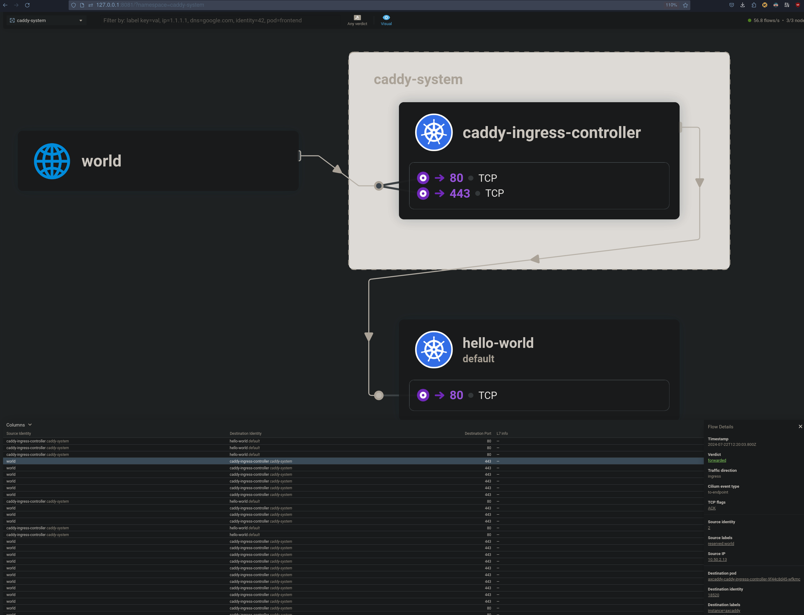
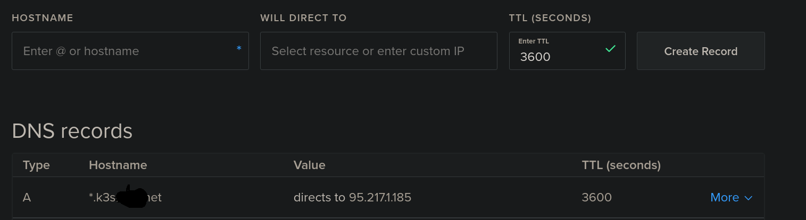
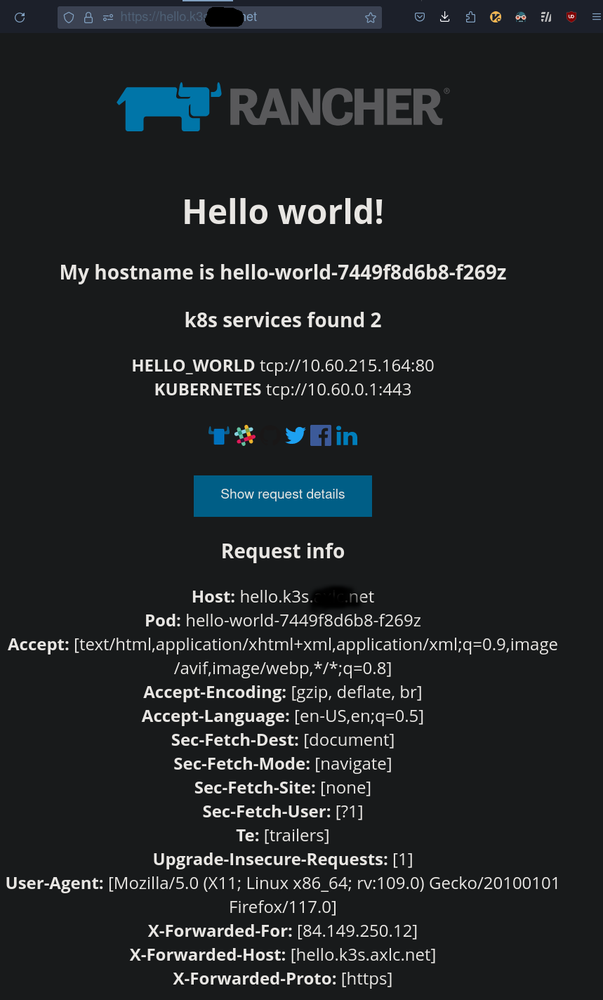

# Setting up networking

[Deployment](./cilium/)

In the metallb chapter we did realize **observability** is crucial.

That's why we go now to use a different CNI, away from the default, which is iptables prerouting rules based flannel


## Cilium

This is the default solution, company wide - for good reasons.

Note: In the cluster setup we already set flannel to false, which prepared the cluster to accept the simple:

Check [these](./cilium/values.yaml) and apply:

```bash
helm template cilium cilium/cilium --namespace cilium --create-namespace --version=1.14.3 -f values.yaml  > manifest.yaml
k apply -f manifest.yaml
```

## Ingress

We use [caddy ingress](https://github.com/caddyserver/ingress) - auto https and even auto tls are pretty useful later.

```values.yaml
# nodeSelector:
#   kubernetes.io/hostname: bast
replicaCount: 2
ingressController:
  config:
    debug: true
    email: "gk@axiros.com"
    onDemandTLS: false
    proxyProtocol: true
```

## Proxy Protcol?

We've set `proxyProtocol: true` in the ingress controller. What is this.

Answer: This is **key** for the app seeing the **source IPs**:

> The Proxy Protocol was originally developed by HAProxy Technologies. While it
> has been widely adopted and is used by many software applications, it is not
> an official IETF (Internet Engineering Task Force) standard.
> 
> The Proxy Protocol is designed to solve an issue with TCP and SSL/TLS
> connections being forwarded by proxies or load balancers: when a connection
> is forwarded, the original client's IP address is lost, and the backend
> server only sees the proxy's IP address.
> 
> The Proxy Protocol solves this issue by adding a small header at the start of
> the TCP connection that contains the original client's IP address and port.
> The backend server can then read this header to get the client's IP address.
> 
> While the Proxy Protocol is not an official IETF standard, it is documented
> and its specifications are publicly available. The latest version (version 2)
> of the protocol is described in detail in the HAProxy Proxy Protocol
> documentation.


https://www.haproxy.org/download/1.8/doc/proxy-protocol.txt


Looks like this, from a tcpflow from loadbalancer to http server behind it:

```
PROXY TCP4 192.168.0.1 192.168.0.11 56324 443
GET / HTTP/1.1
Host: 192.168.0.11
\r\n
```

(there is also a binary version v2 for this)

[Here](https://github.com/mholt/caddy-l4/blob/master/modules/l4proxy/proxy.go) and implementation of it, in go.

=> simple and straightforward.

## Bastion Proxy

The job of the bastion node is to forward that into the cluster. Since it is the only public ip in the setup, i.e. the only host who will 'see' the public source IP addresses. 

Remember: Our original goal was a simply recoverable bastion node an pub ip and 10.0.0.2, acting also as a loadbalancer, replacing the need for one from the infra provider, which would cast 8Euro/month, sidennote.

Naturally we picked caddy but require an xcaddy build:

    xcaddy build --with github.com/mholt/caddy-l4

Config (json only - but they [soon](https://github.com/mholt/caddy-l4/pull/217) have Caddyfile support for this):

```json
{
  "logging": {
    "sink": {
      "writer": {
        "output": "stdout"
      }
    },
    "logs": {
      "default": {
        "level": "DEBUG"
      }
    }
  },

  "apps": {
    "layer4": {
      "servers": {
        "http": {
          "listen": [":80", "[::]:80"],
          "routes": [
            {
              "handle": [
                {
                  "handler": "proxy",
                  "proxy_protocol": "v2",
                  "upstreams": [{ "dial": ["10.0.0.5:30080"] }]
                }
              ]
            }
          ]
        },

        "https": {
          "listen": [":443", "[::]:443"],
          "routes": [
            {
              "handle": [
                {
                  "handler": "proxy",
                  "proxy_protocol": "v2",
                  "upstreams": [{ "dial": ["10.0.0.5:30443"] }]
                }
              ]
            }
          ]
        }
      }
    }
  } 
}
```


plus 

```ini
root@bast:~# cat /etc/systemd/system/caddy.service
[Unit]
Description=Caddy Web Server
Documentation=https://caddyserver.com/docs/
After=network.target

[Service]
ExecStart=/root/caddy/caddy run --config /root/caddy/config.json
TimeoutStopSec=5s
LimitNOFILE=1048576
LimitNPROC=512
PrivateTmp=true
ProtectSystem=full
AmbientCapabilities=CAP_NET_BIND_SERVICE

[Install]
WantedBy=multi-user.target
```

### Discussion

Key is the proxy_protocol and the fowarding to the Node Port, which we hard configured in the ingress, for the ingress controller caddy.

The inner caddy will now get the information about the source IPs and will forward to the apps, as X-Forwarded-For header.


> Little wtf avoider: `SO_REUSEPORT` is set in debian's binaries for nc. Cost me an hour to find caddy WAS running and bound to port 80 **ALLTHOUGH** netcat was already bound. 

    strace nc -l -p 80

Use something like `python -m http.serve 80` if you want to go sure, if a port is bound or not.


## Test

```yaml
apiVersion: apps/v1
kind: Deployment
metadata:
  name: hello-world
  labels:
    app: hello-world
spec:
  replicas: 1
  selector:
    matchLabels:
      app: hello-world
  template:
    metadata:
      labels:
        app: hello-world
    spec:
      containers:
      - name: hello-world
        image: rancher/hello-world
        ports:
        - containerPort: 80
---
apiVersion: v1
kind: Service
metadata:
  name: hello-world
spec:
  selector:
    app: hello-world
  ports:
    - protocol: TCP
      port: 80
      targetPort: 80
---
apiVersion: networking.k8s.io/v1
kind: Ingress
metadata:
  name: hello-world
spec:
  ingressClassName: caddy
  rules:
  - host: hello-world.95.217.1.185.nip.io  <!---- replace with your bastion node pub ip
    http:
      paths:
      - path: /
        pathType: Prefix
        backend:
          service:
            name: hello-world
            port:
              number: 80
```

apply then:

```

❯ wget -q http://hello-world.95.217.1.185.nip.io/ -O - | grep Forwarded

      <b>X-Forwarded-For:</b> [84.149.250.12]<br />
      <b>X-Forwarded-Host:</b> [hello-world.95.217.1.185.nip.io]<br />
      <b>X-Forwarded-Proto:</b> [https]<br />


```

🎇 Oh yeah.


Btw: On hubble ui it looks like this.




## Profit

Now, organize a wild card DNS, pointing to your bastion pub IP and change the host in hello world

E.g. on digitalocean, I literally entered `*.k3s` on my domain to get that:




Then change the `nip.io` hostname to yours, e.g.

     …/gitops/caddy_ingress❯ cat hello-world.yaml | grep host 
        #- host: hello-world.95.217.1.185.nip.io
      - host: hello.k3s.mydomain.net
      - host: hello-world.95.217.1.185.nip.io  <!---- replace with your bastion node pub ip

and apply.

Then visit.




No certmanager was involved. No configmap and other stuff.


In deep love with caddy ❤️

