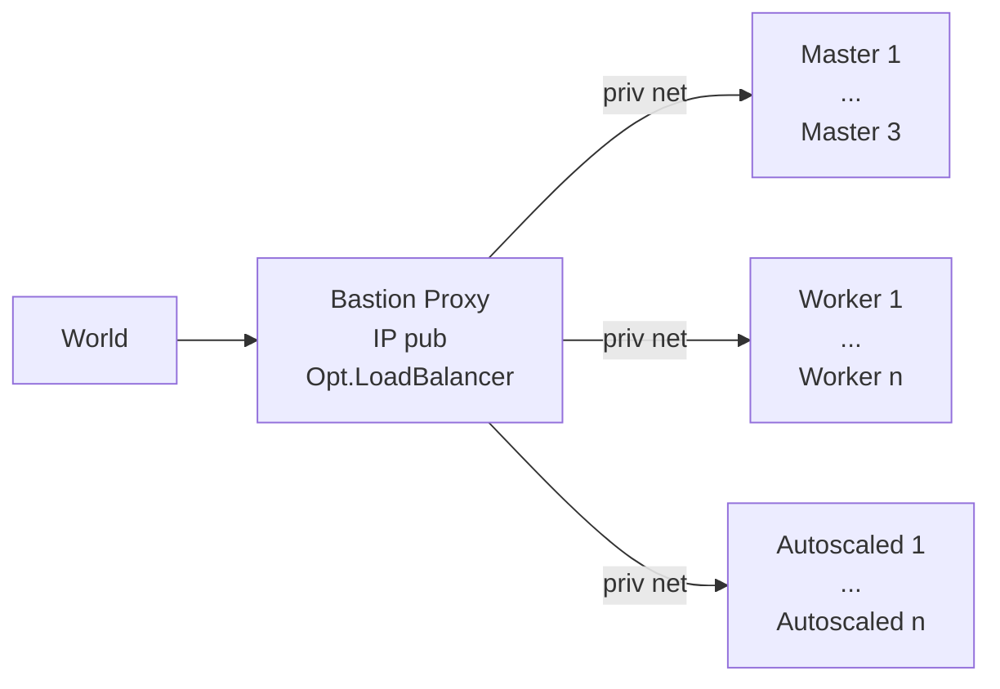

# Private IP Only Cluster

Below details about a private IP only cluster, set up with [hetzner-k3s][hk], are provided.

We describe a setup, where the cluster is 'behind' a proxy node, with a pub ip, reachable via ssh. Alternatively, you could add a vpn on top.


Why:

1. want a cost effective cluster, but
1. don't want to ever have to recover a broken k8s. So: 3 masters.
1. => Workloads on (cheap) masters - but with **autoscaled** add/delete workers if required.

IPs: Priv IPs are for free -> Only 1 pub IP (on a bastion outside the k8s cluster, which runs trivially restorable services w/o k8s). Also more secure, only this to shield.

💡 [This repo](https://github.com/axgkl/hk3sf) provides a set of bash functions, to automate that setup.

# Preparation

- Create a private network, using the hetzner ui, say on 10.1.0.0/16, named `ten-1`.
- Create a bastion node, with a pub ip and membership within that network. Usually that first node gets `.2` assigned, i.e. `10.1.0.2` in our example.
- Secure the node like you want but keep allowing outgoing traffic to the internet and ssh access from your local machine, possibly from a jump host.

💡 The node may be super slim, resource/cost wise. Distribution: We tested with ubuntu/amd64, but any other _should_ work as well.

## On Bastion Node

### Tools

Log in with ssh and install

- [hetzner-k3s][hk]
- [kubectl](https://kubernetes.io/docs/tasks/tools/install-kubectl/)
- [helm](https://helm.sh/docs/intro/install/)

💡 The [setup functions](../setup.sh) in this repo use [binenv][binenv] to install kubectl and helm, since fast, distri independent and w/o the need for a big package mgmt. framework.

### Config

#### System

Enable ip forwarding and masquerading persistently, so that the kubernetes nodes can access the Internet.

E.g. with such a unit file, if the public ip is on `eth0`:

```ini
[Unit]
Description=Bastion IP Forwarder

[Service]
Type=oneshot
ExecStart=/bin/bash -c 'echo 1 > /proc/sys/net/ipv4/ip_forward'
ExecStart=/bin/bash -c 'iptables -t nat -A POSTROUTING -s "10.1.0.0/16" -o eth0 -j MASQUERADE'

[Install]
WantedBy=multi-user.target
```

Also create ssh keys on the bastion node, we reference those in the hetzner-k3s config.

### hetzner-k3s Config

Here is a config, tested with v2 of hetzner-k3s:

```yaml
---
cluster_name: "citest"
kubeconfig_path: "./kubeconfig"
k3s_version: "v1.30.2+k3s2"
networking:
  ssh:
    port: 22
    use_agent: false
    public_key_path: "~/.ssh/id_ed25519.pub"
    private_key_path: "~/.ssh/id_ed25519"
  allowed_networks:
    ssh:
      - 0.0.0.0/0
    api:
      - 0.0.0.0/0
  public_network:
    ipv4: false # that's what this is all about
    ipv6: true
  private_network:
    enabled: true
    subnet: 10.1.0.0/16 # our example priv network. adapt to yours.
    existing_network_name: "ten-1"
  cni:
    enabled: true
    encryption: false
    mode: cilium # optional, flannel default
  cluster_cidr: "10.50.0.0/16"
  service_cidr: "10.60.0.0/16"
  cluster_dns: "10.60.0.10"
datastore:
  mode: etcd # etcd (default) or external
  external_datastore_endpoint: postgres://....
schedule_workloads_on_masters: true

masters_pool:
  instance_type: "cx22"
  instance_count: 3
  location: "hel1"
  image: "ubuntu-24.04"

worker_node_pools:
  - name: citest-small-static
    instance_type: "cx22"
    instance_count: 0 # like you want
    location: "hel1"
    image: "ubuntu-24.04"

  - name: citest-medium-autoscaled
    instance_type: "cx22"
    instance_count: 3
    location: "hel1"
    image: "ubuntu-24.04"
    autoscaling:
      enabled: true
      min_instances: 0
      max_instances: 3

embedded_registry_mirror:
  enabled: true

additional_packages:
  - ifupdown
api_server_hostname: first_master # tested with this but should work w/o that as well.

post_create_commands:
  - echo "Started" > /.status # just to debug
  - timedatectl set-timezone Europe/Berlin
  - echo 'ecdsa-sha2-nistp256 AAAAE2V....= root@citest-proxy' >> /root/.ssh/authorized_keys
  - echo 'ecdsa-sha2-nistp256 AAAAE2V....= gk@axgk' >> /root/.ssh/authorized_keys
  - echo "root:$(head -c 50 /dev/urandom | base64)" | chpasswd
  - mkdir -p /etc/network/interfaces.d
  - iface="$(ip -o -4 addr list | grep " 10.1." | cut -d " " -f 2)"
  - |
    cat > /etc/network/interfaces.d/$iface <<EOF
    auto $iface
    iface $iface inet dhcp
      post-up ip route add default via 10.1.0.1
      post-up ip route add 169.254.169.254 via 172.31.1.1
    EOF
  - rm -f /etc/resolv.conf
  - |
    cat > /etc/resolv.conf <<EOF
    nameserver 185.12.64.1
    nameserver 185.12.64.2
    edns edns0 trust-ad
    search .
    EOF
  - ip route add 169.254.0.0/16 via 172.31.1.1
  - ip route add default via 10.1.0.1
  - echo "Done" > /.status # just to debug
```

#### Notes on the Post Create Config

These commands are basically run as cloud init, after a node is created.

Since we use the 'classic' way of configuring the network, using /etc/network/interfaces.d, on ubuntu we needed to add the `ifupdown` package.

- Added ssh pub keys, which should be allowed to log in to the k3s nodes.
- Run `chpasswd`, in order to avoid any mails from hetzner, reminding you to change the password, after autoscaled nodes are created.
- Find the interface name of the one interface, which is in the private network (distri dependent)
- Create the interface config file, with the default route to the gateway of the private network, which is our bastion node. This has to be the `.1` address, not the priv ip of the bastion node!
- Also add a route to hetzner's api server on 169.254.169.254, which seems to be always via 172.31.1.1
- Lastly we configure hetzner's DNS servers and configure the above routes via cli commands, avoiding the need for a reboot.

With such a config, the hetzner-k3s setup should run through, creating a private IP only cluster.

### Post Create

#### Local kubectl/helm support

You want to copy the kubeconfig file, which the installer script created on the bastion node to your local machine, so that you can manage the cluster from there.

I change the server line within the copied local kubeconfig to this:

```yaml
server: https://127.0.0.1:16443
```

and configure ssh like this:

```config
# ---- cluster citest
Host citest-proxy
    HostName 37.27.... # pub ip of the bastion node
    User root
    Port 22
    LocalForward 16443 10.1.0.3:6443 # first master
Host citest-m1
    HostName 10.1.0.3
    User root
    Port 22
    ProxyCommand ssh -W %h:%p citest-proxy
Host citest-m2
    HostName 10.1.0.4
    User root
    Port 22
    ProxyCommand ssh -W %h:%p citest-proxy
Host citest-m3
    HostName 10.1.0.5
    User root
    Port 22
    ProxyCommand ssh -W %h:%p citest-proxy
# ---- cluster citest
```

#### Load Balancer on Bastion Node

You can install a layer 4 load balancer on bastion, turning it into a full proxy into your cluster, eradicating the need for a hetzner load balancer.

[This repo](https://github.com/axgkl/hk3sf) explains how to do that.

[hk]: https://github.com/vitobotta/hetzner-k3s
[binenv]: https://github.com/devops-works/binenv
